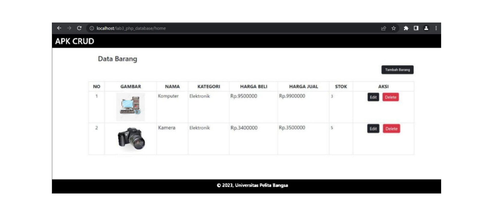

# Lab4Web
=======
# Tugas Pemrograman Web 2
## Profile
<body>
    <table border="1">
        <tr>
            <th> Nama</th>
            <th>NIM</th>
            <th>Kelas</th>
        </tr>
        <tr>
            <td>Billy Alfauzi Caesar</td>
            <td>312110152</td>
            <td>TI.21.A.1</td>
        </tr>
    </table>
</body>

## Beginning
- Pertama siapkan Text Editor
- Buat Folder baru dengan nama lab4_php_modular di htdocs

## Next
- Ubah Nama index.php menjadi view.php pada pertemuan 3.
- Lalu buat file baru dengan nama index.php, lalu masukan kode berikut.

```php
<?php
$mod = @$_REQUEST['mod'];
switch ($mod) {
  case "view":
    require("view.php");
    break;
  case "tambah":
    require("tambah.php");
    break;
 default:
}
?>
```
# Aktifasi mod_rewrite (.htaccess)
<p>Mod_rewrite digunakan untuk mengubah URL dari query string menjadi SEO Friendly.</p>

- Langkah awal yang harus disiapkan adalah aktivasi mod_rewrite pada Web Server Apache2 pada configurasi httpd.conf.


- Aktifkan LoadModule mod_rewrite dengan cara melakukan un-comment pada baris tersebut, kemudian restart Apache2.
- Langkah berikutnya adalah membuat file baru dalam folder Lab4Web dengan nama .htaccess, kemudian masukan kode berikut.

```.htaccess
<IfModule mod_rewrite.c>
  RewriteEngine On
  RewriteBase /LabWeb/Lab4Web
  RewriteCond %{REQUEST_FILENAME} !-f
  RewriteCond %{REQUEST_FILENAME} !-d
  RewriteRule ^(.*)$ index.php?mod=$1 [L]
</IfModule>
```

### Cara mengaksesnya menjadi:
- Halaman View (http://localhost/LabWeb/Lab4Web/view)
- Halaman Tambah Barang (http://localhost/LabWeb/Lab4Web/tambah)

### Tampilan Home


### Tampilan Tambah


- Done

# Panjang Umur Untuk Semua Hal-Hal Baik
